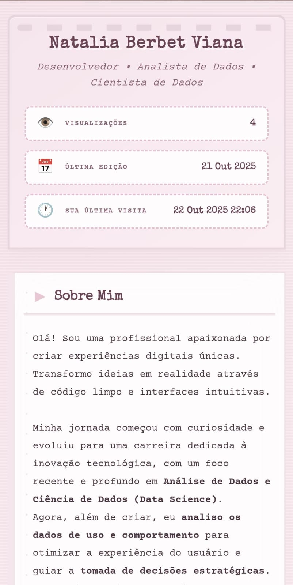

<div align="center">

# ✨ Portfólio Profissional

### 💼 Natalia Berbet Viana

<p align="center">
  
  
  
</p>

<p align="center">
  <strong>Um showcase elegante e responsivo das minhas habilidades e projetos</strong>
</p>

<p align="center">
  <a href="https://nataliaberbetviana.github.io" target="_blank">
    
  </a>
</p>

---

</div>

## 📋 Sobre o Projeto

Este portfólio foi desenvolvido com foco em **design vintage** e **experiência do usuário**, apresentando uma estética única inspirada em máquinas de escrever antigas com tons suaves de rosa pastel.

### ✨ Destaques

- 🎨 Design retrô com estética de máquina de escrever
- 📱 Totalmente responsivo para todos os dispositivos
- ⚡ Performance otimizada e carregamento rápido
- 🎭 Animações suaves e interativas
- 💡 Código limpo e bem organizado

---

## 🛠️ Tecnologias

<div align="center">


</div>

### 🔧 Stack Principal

```
📦 Tecnologias Utilizadas
 ┣ 🏗️  HTML5 - Estrutura semântica moderna
 ┣ 🎨 CSS3 - Animações e design responsivo
 ┗ ⚙️  JavaScript - Interatividade (quando necessário)
```

---

## 📂 Estrutura do Projeto

```
📁 nataliaberbetviana.github.io/
│
├── 📄 index.html              # Página principal
├── 📄 styles.css              # Estilos globais
│
├── 📁 css/                    # Arquivos de estilo
│   ├── styles.css
│   └── [outros arquivos]
│
├── 📁 images/                 # Recursos visuais
│   ├── projects/
│   ├── icons/
│   └── assets/
│
├── 📁 js/                     # Scripts JavaScript
│   └── scripts.js
│
└── 📄 README.md               # Você está aqui! 😊
```

---

## 🚀 Como Usar

### Método 1: Clonar o Repositório

```bash
# Clone o repositório
git clone git@github.com:nataliaberbetviana/nataliaberbetviana.github.io.git

# Entre na pasta do projeto
cd nataliaberbetviana.github.io

# Abra o index.html no navegador
# Ou use um servidor local como Live Server
```

### Método 2: Download Direto

1. Clique no botão **Code** > **Download ZIP**
2. Extraia os arquivos
3. Abra `index.html` no seu navegador favorito

### 🎨 Personalizando

Para adaptar este portfólio para você:

1. **Edite `index.html`**: Altere seu nome, projetos e informações
2. **Customize `styles.css`**: Ajuste cores, fontes e espaçamentos
3. **Adicione suas imagens**: Substitua os placeholders na pasta `images/`

---

## 🎯 Funcionalidades

<table>
  <tr>
    <td align="center">🎨</td>
    <td><strong>Design Vintage</strong><br/>Estética única inspirada em máquinas de escrever</td>
  </tr>
  <tr>
    <td align="center">📱</td>
    <td><strong>Responsivo</strong><br/>Funciona perfeitamente em mobile, tablet e desktop</td>
  </tr>
  <tr>
    <td align="center">⚡</td>
    <td><strong>Animações Suaves</strong><br/>Transições e efeitos que encantam</td>
  </tr>
  <tr>
    <td align="center">♿</td>
    <td><strong>Acessível</strong><br/>Pensado para todos os usuários</td>
  </tr>
  <tr>
    <td align="center">🚀</td>
    <td><strong>Performance</strong><br/>Carregamento rápido e otimizado</td>
  </tr>
</table>

---

## 📸 Preview

<div align="center">

### 🖥️ Desktop
)

### 📱 Mobile


</div>

---

## 🌟 Seções do Portfólio

| Seção | Descrição |
|-------|-----------|
| 🏠 **Home** | Apresentação pessoal e boas-vindas |
| 👤 **Sobre Mim** | Trajetória profissional e objetivos |
| 💼 **Projetos** | Showcase dos meus melhores trabalhos |
| 🎓 **Habilidades** | Tecnologias e competências técnicas |
| 📬 **Contato** | Formas de entrar em contato |

---

## 📬 Contato

<div align="center">

### 💌 Vamos conversar?

<p>
  <a href="https://www.linkedin.com/in/nataliaberbetviana" target="_blank">
    
  </a>
  <a href="mailto:nabevia@gmail.com">
    
  </a>
  <a href="https://github.com/nataliaberbetviana" target="_blank">
    
  </a>
</p>

</div>

---

## 📝 Licença

Este projeto está sob a licença MIT. Sinta-se livre para usar como inspiração!

---

<div align="center">

### ⭐ Se você gostou deste projeto, deixe uma estrela!

**Feito com 💜 por [Natalia Berbet Viana](https://github.com/nataliaberbetviana)**

<sub>Última atualização: Outubro 2025</sub>

</div>